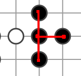

# <a href="https://en.wikipedia.org/wiki/Go_(game)">Go</a> over WebSocket

Go is an ancient game that involves two players competing on a grid for space.
The goal is to surround the largest amount of area. See the above Wikipedia
article for more information.

I started this project for three reasons:

 1. I like the game of Go
 2. Playing it requires a board and a bunch of stones (web is better than real life)
 3. I wanted to learn the HTML5 Canvas and WebSocket APIs

I started thinking about reason 3 during a talk at Cascadia Ruby conference in Portland,
the speakers were showing off a WebSocket-based chat app that the audience was participating
in.

TODO:

 - [x] Implement Pair, Set, Graph
 - [x] hook up graph North,South,East,West edges on Board.putPiece
 - [x] Switch the order of the board coordinates so x is first, y is second
 - [x] Add Queue#contains
 - [x] Vertex holds a Pair of coordinates
 - [x] Adding makes an edge from the pairs of the adjacent vertices
 - [x] Use new Pair, Set and Graph types
 - [x] Add Set#remove
 - [x] Find neighborhood of vertex
 - [x] Implement BFS to find connected components
 - [ ] Define libertiesCount() function to count the liberties of a component
 - [ ] Add scoring rules to program
 - [ ] Save state in localStorage
 - [ ] Add clear board button
 - [ ] Hook up a WebSocket (before this, learn how to WebSocket)

# Data Structures

The board is represented using a 2D array of `Vertex` objects, each of which
has a `color` property.

The `color` defaults to `null`, but can be switched to `black` or `white`.

Each vertex has up to four edges, which can connect to adjacent vertices of the
same color. This defines an implicit graph.

Using the implicit graph, a `ComponentMap` object is used to find the connected 
components, then expose an iterator that visits each component once.

# Algorithms

  - [BFS (Breadth-First Search)](https://github.com/tlehman/go-websocket/blob/master/bfs.md) to find connected components of pieces.
